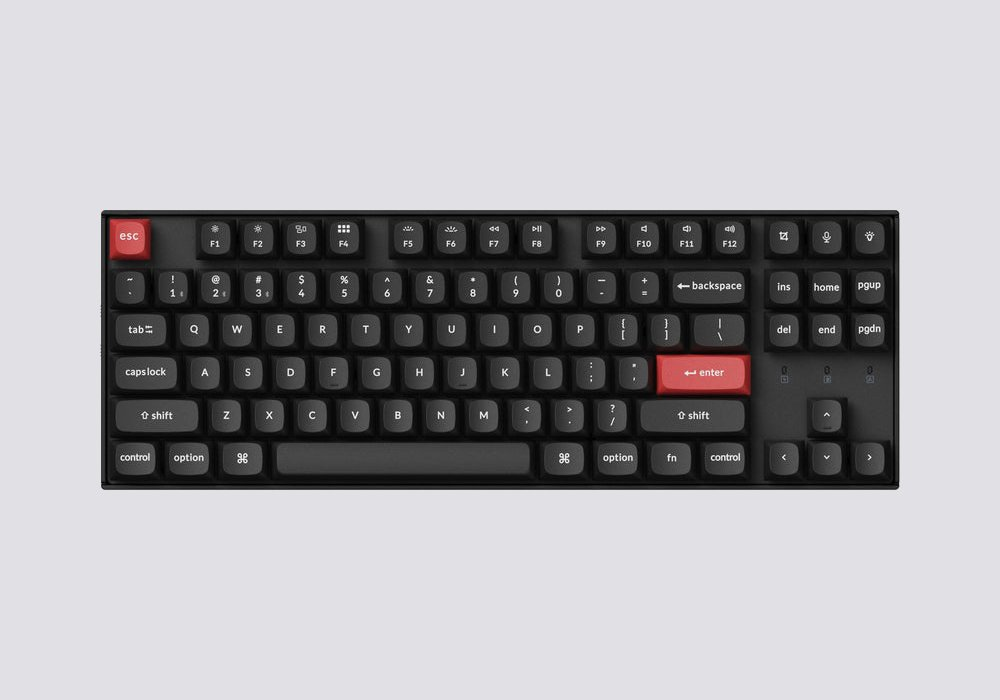

# QMK Keyboards

A collection of stuff related to my qmk keyboards.

## TOC
- [Imperial44](#imperial44)
- [CSTC40](#cstc40)
- [Keychron K8 Pro](#keychron-k8-pro)

## Imperial44

### Pretty!

*Can't even use normal keyboards efficiently anymore because got used to this one too much.*

### Links

- [Vial and flash](https://ergohaven.xyz/docs/imperial44)
- [Firmware binary](https://github.com/ergohaven/keymap_hub)
- [Firmware source](https://github.com/ergohaven/vial-qmk/tree/vial/keyboards/ergohaven)
- [Body STL for printing](https://github.com/ergohaven/imperial44)
- [PCB design](https://oshwlab.com/yuriiq/imperial44v1)

### Layouts

- [Original'ish](vial/imperial44-original.vil)
- [Adjusted](vial/imperial44.vil)
- [Encoders (current)](vial/imperial44-encoders.vil)

### Notes

- [Those damn colors](notes/imperial44-colors.txt)

## CSTC40

### It's dum!

*A constant experiment adapting for my current needs without any regards for standards.*

### Links

- [Improved firmware (until it gets merged)](https://github.com/itsvar8/vial-qmk/tree/cstc40)

### Layouts

- [Empty](vial/cstc40-empty.vil)
- [Vertical](vial/cstc40-space-sim.vil)
- [FT 2 (current)](vial/cstc40-fasttracker-2.vil)

### Notes

- [Firmware Mods](notes/cstc40-mods.txt)

## Keychron K8 Pro

### Solid choice!

*When everything else fails...*

### Links

- none

### Layouts

- TODO: add current layout (next line is a dud)
- [Normal (current)](vial/keychron-k8-pro.vil)

### Notes

- none

