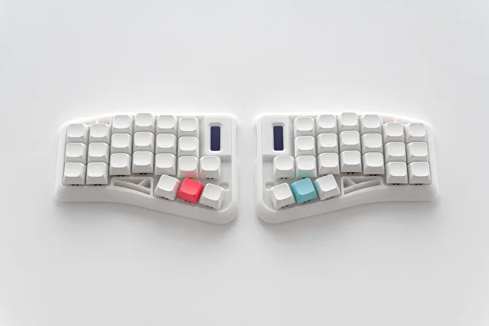
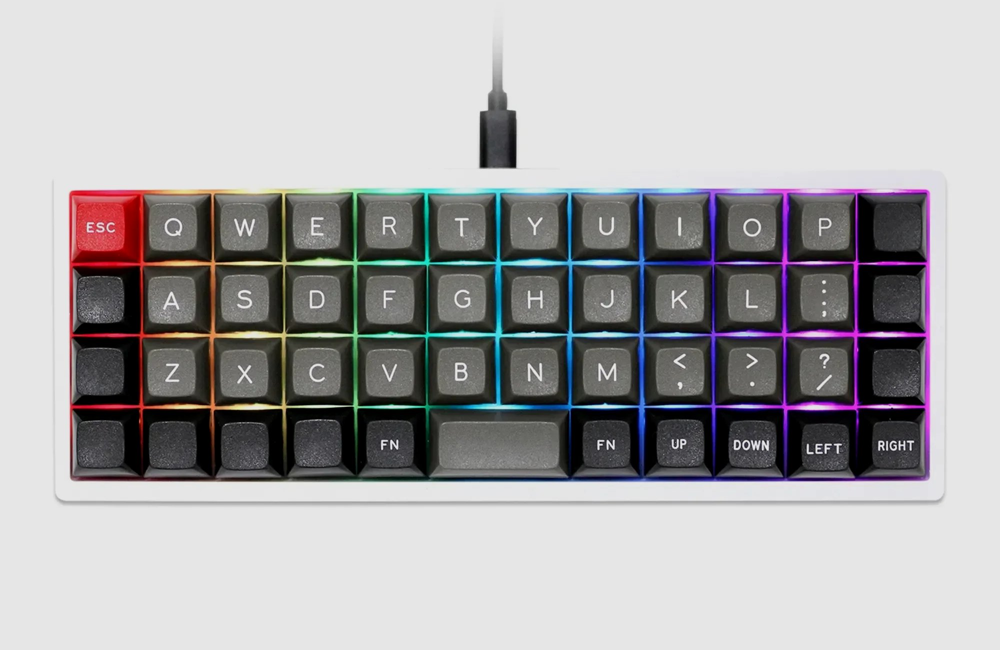

# QMK Keyboards

A collection of stuff related to my qmk keyboards.

## TOC
- [Imperial44](#imperial44)
- [CSTC40](#cstc40)

## Imperial44

### Pretty!

### What?

It's just links and layout backup for myself.

*Can't even use normal keyboards anymore because got used to this one too much.*

### Links

- [Vial and flush](https://ergohaven.xyz/docs/imperial44)
- [Firmware binary](https://github.com/ergohaven/keymap_hub)
- [Firmware source](https://github.com/ergohaven/vial-qmk/tree/vial/keyboards/ergohaven)
- [Body STL for printing](https://github.com/ergohaven/imperial44)
- [PCB design](https://oshwlab.com/yuriiq/imperial44v1)

### Other

- [Current layout](vial/imperial44-adjust.vil)
- [Those damn colors](notes/imperial44-colors.txt)

## CSTC40

### It' dum!

### Links

- [Improved firmware (util gets merged)](https://github.com/itsvar8/vial-qmk/tree/cstc40)

### Other

- [Space Sim layout](vial/cstc40-space-sim.vil)
- [Fasttracker 2 layout](vial/cstc40-fasttracker-2.vil)
- [Firmware Mods](notes/cstc40-mods.txt)

