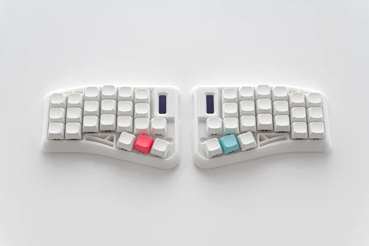

# Imperial44

## Pretty!

## What?

A collection of stuff related to this keyboard.

But actually it's just links and layout backup for myself.

*Can't even use normal keyboards anymore because got used to this one too much.*

## Links

- [Vial and flush](https://ergohaven.xyz/docs/imperial44)
- [Firmware binary](https://github.com/ergohaven/keymap_hub)
- [Firmware source](https://github.com/ergohaven/vial-qmk/tree/vial/keyboards/ergohaven)
- [Body STL for printing](https://github.com/ergohaven/imperial44)
- [PCB design](https://oshwlab.com/yuriiq/imperial44v1)

## Other

- [Current layout](imperial44-adjust.vil)
- [Those damn colors](imperial44-colors.txt)

